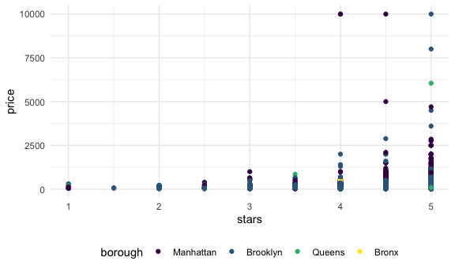
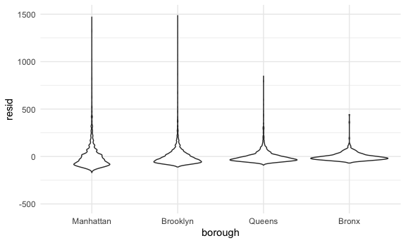
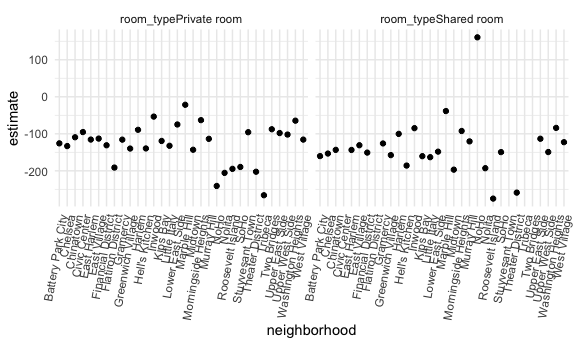

Linear models
================

## import data

``` r
data("nyc_airbnb")

nyc_airbnb = 
  nyc_airbnb %>% 
  mutate(stars = review_scores_location / 2) %>% 
  rename(
    borough = neighbourhood_group,
    neighborhood = neighbourhood) %>% 
  filter(borough != "Staten Island") %>% 
  select(price, stars, borough, neighborhood, room_type)
```

## fit model

look at result better

``` r
broom::glance(fit)
```

    ## # A tibble: 1 × 12
    ##   r.squared adj.r.squared sigma statistic   p.value    df   logLik    AIC    BIC
    ##       <dbl>         <dbl> <dbl>     <dbl>     <dbl> <dbl>    <dbl>  <dbl>  <dbl>
    ## 1    0.0342        0.0341  182.      271. 6.73e-229     4 -202113. 4.04e5 4.04e5
    ## # … with 3 more variables: deviance <dbl>, df.residual <int>, nobs <int>

``` r
fit %>% 
  broom::tidy()
```

    ## # A tibble: 5 × 5
    ##   term             estimate std.error statistic  p.value
    ##   <chr>               <dbl>     <dbl>     <dbl>    <dbl>
    ## 1 (Intercept)         -70.4     14.0      -5.02 5.14e- 7
    ## 2 stars                32.0      2.53     12.7  1.27e-36
    ## 3 boroughBrooklyn      40.5      8.56      4.73 2.23e- 6
    ## 4 boroughManhattan     90.3      8.57     10.5  6.64e-26
    ## 5 boroughQueens        13.2      9.06      1.46 1.45e- 1

``` r
fit %>% 
  broom::tidy() %>% 
  select(term, estimate, p.value) %>% 
  mutate(term = str_replace(term, "^borough", "Borough: ")) %>% 
  knitr::kable(digits = 3)
```

| term               | estimate | p.value |
|:-------------------|---------:|--------:|
| (Intercept)        |  -70.414 |   0.000 |
| stars              |   31.990 |   0.000 |
| Borough: Brooklyn  |   40.500 |   0.000 |
| Borough: Manhattan |   90.254 |   0.000 |
| Borough: Queens    |   13.206 |   0.145 |

# be in control the factors

``` r
nyc_airbnb = 
  nyc_airbnb %>% 
  mutate(
    borough = fct_infreq(borough),
    room_type = fct_infreq(room_type))

nyc_airbnb %>% 
  ggplot(aes(x=stars, y=price,color=borough))+
  geom_point()
```

    ## Warning: Removed 9962 rows containing missing values (geom_point).



``` r
fit = lm(price ~ stars + borough, data = nyc_airbnb)
broom::tidy(fit)
```

    ## # A tibble: 5 × 5
    ##   term            estimate std.error statistic   p.value
    ##   <chr>              <dbl>     <dbl>     <dbl>     <dbl>
    ## 1 (Intercept)         19.8     12.2       1.63 1.04e-  1
    ## 2 stars               32.0      2.53     12.7  1.27e- 36
    ## 3 boroughBrooklyn    -49.8      2.23    -22.3  6.32e-109
    ## 4 boroughQueens      -77.0      3.73    -20.7  2.58e- 94
    ## 5 boroughBronx       -90.3      8.57    -10.5  6.64e- 26

``` r
broom::glance(fit)
```

    ## # A tibble: 1 × 12
    ##   r.squared adj.r.squared sigma statistic   p.value    df   logLik    AIC    BIC
    ##       <dbl>         <dbl> <dbl>     <dbl>     <dbl> <dbl>    <dbl>  <dbl>  <dbl>
    ## 1    0.0342        0.0341  182.      271. 6.73e-229     4 -202113. 4.04e5 4.04e5
    ## # … with 3 more variables: deviance <dbl>, df.residual <int>, nobs <int>

## diagnostics

``` r
modelr::add_residuals(nyc_airbnb, fit)
```

    ## # A tibble: 40,492 × 6
    ##    price stars borough neighborhood room_type        resid
    ##    <dbl> <dbl> <fct>   <chr>        <fct>            <dbl>
    ##  1    99   5   Bronx   City Island  Private room      9.47
    ##  2   200  NA   Bronx   City Island  Private room     NA   
    ##  3   300  NA   Bronx   City Island  Entire home/apt  NA   
    ##  4   125   5   Bronx   City Island  Entire home/apt  35.5 
    ##  5    69   5   Bronx   City Island  Private room    -20.5 
    ##  6   125   5   Bronx   City Island  Entire home/apt  35.5 
    ##  7    85   5   Bronx   City Island  Entire home/apt  -4.53
    ##  8    39   4.5 Bronx   Allerton     Private room    -34.5 
    ##  9    95   5   Bronx   Allerton     Entire home/apt   5.47
    ## 10   125   4.5 Bronx   Allerton     Entire home/apt  51.5 
    ## # … with 40,482 more rows

``` r
nyc_airbnb %>% 
  modelr::add_residuals(fit) %>% 
  ggplot(aes(x = borough, y = resid)) + geom_violin() + ylim(-500,1500) #zoom in
```

    ## Warning: Removed 9993 rows containing non-finite values (stat_ydensity).



``` r
nyc_airbnb %>% 
  modelr::add_residuals(fit) %>% 
  ggplot(aes(x = stars, y = resid)) + geom_point()+facet_wrap(.~borough)
```

    ## Warning: Removed 9962 rows containing missing values (geom_point).


# hypothesis test

t-test by default

``` r
fit %>% 
  broom::tidy()
```

    ## # A tibble: 5 × 5
    ##   term            estimate std.error statistic   p.value
    ##   <chr>              <dbl>     <dbl>     <dbl>     <dbl>
    ## 1 (Intercept)         19.8     12.2       1.63 1.04e-  1
    ## 2 stars               32.0      2.53     12.7  1.27e- 36
    ## 3 boroughBrooklyn    -49.8      2.23    -22.3  6.32e-109
    ## 4 boroughQueens      -77.0      3.73    -20.7  2.58e- 94
    ## 5 boroughBronx       -90.3      8.57    -10.5  6.64e- 26

what about significance of borough

``` r
fit_null = lm(price ~ stars + borough, data = nyc_airbnb)
fit_alt = lm(price ~ stars + borough + room_type, data = nyc_airbnb)

anova(fit_null, fit_alt) %>% 
  broom::tidy()
```

    ## # A tibble: 2 × 6
    ##   res.df         rss    df     sumsq statistic p.value
    ##    <dbl>       <dbl> <dbl>     <dbl>     <dbl>   <dbl>
    ## 1  30525 1005601724.    NA       NA        NA       NA
    ## 2  30523  921447496.     2 84154228.     1394.       0

# nest data, fit model

pretty formal and also complex

``` r
nyc_airbnb %>% 
  lm(price ~ stars * borough + room_type * borough, data = .) %>% 
  broom::tidy() %>% 
  knitr::kable(digits = 3)
```

| term                                   | estimate | std.error | statistic | p.value |
|:---------------------------------------|---------:|----------:|----------:|--------:|
| (Intercept)                            |   95.694 |    19.184 |     4.988 |   0.000 |
| stars                                  |   27.110 |     3.965 |     6.838 |   0.000 |
| boroughBrooklyn                        |  -26.066 |    25.080 |    -1.039 |   0.299 |
| boroughQueens                          |   -4.118 |    40.674 |    -0.101 |   0.919 |
| boroughBronx                           |   -5.627 |    77.808 |    -0.072 |   0.942 |
| room\_typePrivate room                 | -124.188 |     2.996 |   -41.457 |   0.000 |
| room\_typeShared room                  | -153.635 |     8.692 |   -17.676 |   0.000 |
| stars:boroughBrooklyn                  |   -6.139 |     5.237 |    -1.172 |   0.241 |
| stars:boroughQueens                    |  -17.455 |     8.539 |    -2.044 |   0.041 |
| stars:boroughBronx                     |  -22.664 |    17.099 |    -1.325 |   0.185 |
| boroughBrooklyn:room\_typePrivate room |   31.965 |     4.328 |     7.386 |   0.000 |
| boroughQueens:room\_typePrivate room   |   54.933 |     7.459 |     7.365 |   0.000 |
| boroughBronx:room\_typePrivate room    |   71.273 |    18.002 |     3.959 |   0.000 |
| boroughBrooklyn:room\_typeShared room  |   47.797 |    13.895 |     3.440 |   0.001 |
| boroughQueens:room\_typeShared room    |   58.662 |    17.897 |     3.278 |   0.001 |
| boroughBronx:room\_typeShared room     |   83.089 |    42.451 |     1.957 |   0.050 |

this is more exploratory and easier to understand

``` r
nest_lm_res =
  nyc_airbnb %>% 
  nest(data = -borough) %>% 
  mutate(
    models = map(data, ~lm(price ~ stars + room_type, data = .x)),
    results = map(models, broom::tidy)) %>% 
  select(-data, -models) %>% 
  unnest(results) %>% 
  filter(term!="(Intercept)") %>% 
  select(borough,term,estimate) %>% 
  pivot_wider(
    names_from = borough,
    values_from = estimate
  )
```

nest even more

``` r
manhattan_airbnb =
  nyc_airbnb %>% 
  filter(borough == "Manhattan")

manhattan_nest_lm_res =
  manhattan_airbnb %>% 
  nest(data = -neighborhood) %>% 
  mutate(
    models = map(data, ~lm(price ~ stars + room_type, data = .x)),
    results = map(models, broom::tidy)) %>% 
  select(-data, -models) %>% 
  unnest(results)

manhattan_nest_lm_res %>% 
  filter(str_detect(term, "room_type")) %>% 
  ggplot(aes(x = neighborhood, y = estimate)) + 
  geom_point() + 
  facet_wrap(~term) + 
  theme(axis.text.x = element_text(angle = 80, hjust = 1))
```


